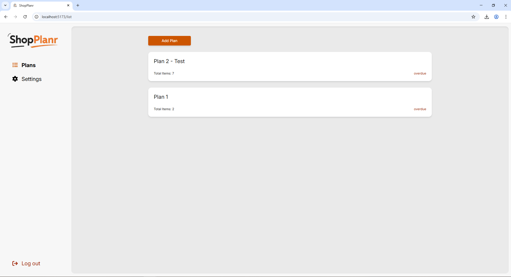
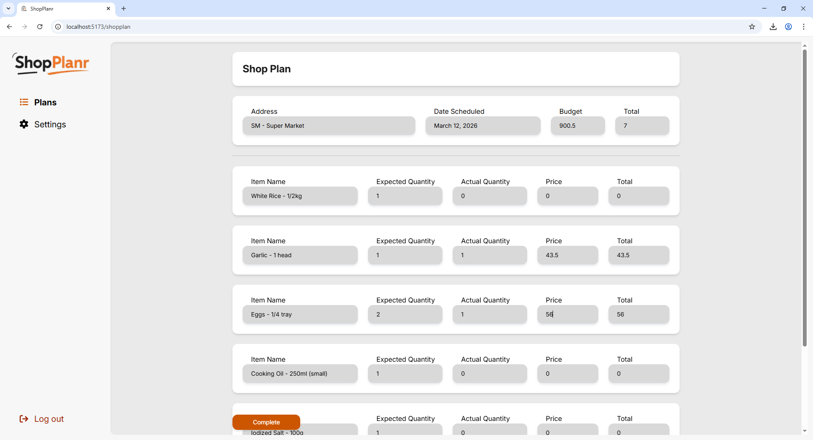

# ShopPlanr — Laravel Blade

> A smart shopping planner that helps you organize your grocery runs, set budgets, and track your actual spending in real time.

---

## 🖥️ Screenshots

| Dashboard                                  | Plan Details                               | Shopping Mode                                 |
| ------------------------------------------ | ------------------------------------------ | --------------------------------------------- |
|  |  |  |

---

## ✨ Features

- 📋 **Create Shopping Plans** — Set up a plan with a store location, scheduled date, and total budget before your shopping trip.
- 🛒 **Plan Your Items** — Add the items you intend to buy, including the planned quantity for each.
- 📍 **Store Location** — Attach a location to each plan so you know exactly where you're headed.
- 📅 **Scheduled Date** — Set a date for the trip so your plans are organized chronologically.
- ✅ **Shopping Mode** — When the scheduled date arrives, activate the plan to start recording your actual purchases.
- 💰 **Real-time Budget Tracking** — Input the actual quantity bought and the price per item; the app automatically deducts from your budget as you shop.
- 🔗 **API + Web Routing** — This version serves both the Blade front-end (via `web.php`) and the shared REST API (via `api.php`) used by the mobile and React web apps.

---

## 🛠 Tech Stack

- **Framework:** Laravel 8
- **Templating:** Blade
- **Database:** MySQL
- **Language:** PHP 8+
- **Also includes:** REST API endpoints consumed by the Expo and React Web versions

---

## 🚀 Setup & Installation

### Prerequisites

Make sure you have the following installed on your machine:

- [PHP](https://www.php.net/) (v8.1 or higher)
- [Composer](https://getcomposer.org/)
- [MySQL](https://www.mysql.com/) (or any compatible DB like MariaDB)
- [Node.js](https://nodejs.org/) (v18+) — for compiling front-end assets

---

### Steps

**1. Clone the repository**

```bash
git clone https://github.com/Just-Pyro/Shopplanr.git
cd shopplanr
```

**2. Install PHP dependencies**

```bash
composer install
```

**3. Install front-end dependencies**

```bash
npm install
```

**4. Set up the environment file**

```bash
cp .env.example .env
```

Open `.env` and update the database credentials:

```env
DB_CONNECTION=mysql
DB_HOST=127.0.0.1
DB_PORT=3306
DB_DATABASE=shopplanr
DB_USERNAME=root
DB_PASSWORD=
```

**5. Generate the application key**

```bash
php artisan key:generate
```

**6. Run database migrations**

```bash
php artisan migrate
```

**7. Build front-end assets**

```bash
npm run dev
```

> For production, use `npm run build` instead.

**8. Start the local development server**

```bash
php artisan serve
```

**9. Open in your browser**

Visit [http://localhost:8000](http://localhost:8000)

---

## 📁 Project Structure

```
shopplanr-blade/
├── app/
│   ├── Http/
│   │   ├── Controllers/     # Web & API controllers
│   └── Models/              # Eloquent models
├── resources/
│   └── views/               # Blade templates
├── routes/
│   ├── web.php              # Blade routes
│   └── api.php              # API routes (shared with Expo & React)
├── database/
│   └── migrations/          # Database schema
└── .env                     # Environment config (not committed)
```

---

## 🔗 Related Repositories

- [ShopPlanr — Expo Mobile](https://github.com/Just-Pyro/shopplanr-expo101)
- [ShopPlanr — React Web](https://github.com/Just-Pyro/ShopPlanr-web)

---

## 📄 License

This project is for portfolio purposes.
